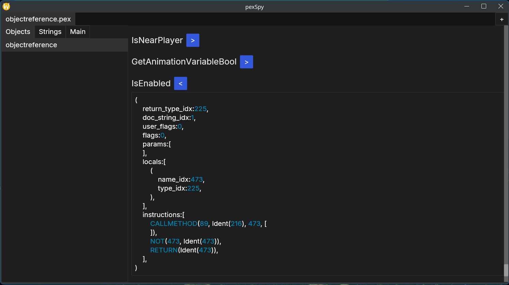

# pexSpy 🔎

This is an editor for `.pex` files, allowing you to edit the metadata and the instructions inside of functions.



## Features

- [x] Disassembler
- [x] Assembler
- [x] GUI
- [ ] Decompiler to Pex Script

## Supported

> [!INFO]
> It isn't difficult to support the pex format across games, there's only a couple minute differences, but I'm only testing with Skyrim so I can't ensure the rest work fine.
> You can submit an issue if you encounter problems, or let me know if it works fine for you.

| Status | Game       |
| ---    | ---        |
| ✅     | Skyrim     |
| ❔     | Fallout 4  |
| ❔     | Fallout 76 |
| ❔     | Starfield  |

As for operating systems, I'm on Linux, I can't promise it works on Windows, but I'm not doing anything specific to my OS.
I'll setup CI for Windows builds when I get around to it.

## For Developers

At some point I'll get around to making this a monorepo with the inner disassembler and assembler exposed as their own functions, so you could use `pexSpy` as a library for whatever tooling you need.

## Building

The only "dependency" you need is [Rust](https://rustup.rs) to build.

All you need to do is clone this repository

```sh
git clone https://github.com/DvvCz/pexSpy
cd pexSpy
```

Then build it with `cargo`.

```sh
cargo build --release
```